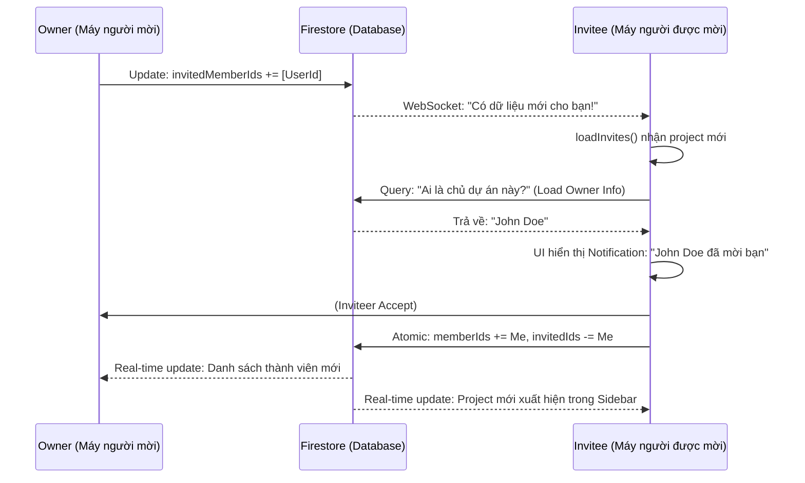

# 👥 Hướng Dẫn Kỹ Thuật: Hệ Thống Quản Lý Thành Viên Dự Án

> **Tài liệu hướng dẫn luồng dữ liệu, trạng thái và đồng bộ hóa real-time cho hệ thống Jira Clone.**

---

## 🛠 1. Mô Hình Dữ Liệu (Data Model)

Hệ thống quản lý thành viên dựa trên hai danh sách ID trong mỗi tài liệu `Project` trên Firestore:

```typescript
interface Project {
  id: string;
  name: string;
  ownerId: string;

  // 🟢 Thành viên chính thức (Đã vào dự án)
  memberIds: string[];

  // 🟡 Thành viên đang đợi (Đã gửi lời mời nhưng chưa phản hồi)
  invitedMemberIds: string[];
}
```

---

## 🏗 2. Quy Trình 3 Bước: Mời - Chấp Nhận - Gia Nhập

### Bước 1: Owner Gửi Lời Mời (The Invitation)

Khi Owner nhập email và bấm "Add":

1.  **Tìm Kiếm**: `ProjectsService` tìm user trong collection `users` theo email.
2.  **Kiểm tra điều kiện**:
    - User có tồn tại không?
    - User đã là thành viên chưa? (`memberIds`)
    - User đã được mời chưa? (`invitedMemberIds`)
3.  **Cập nhật Firestore**: Thêm `uid` của người được mời vào mảng `invitedMemberIds`.

**Code Logic (`projects.store.ts`):**

```typescript
await projectsService.inviteUserToProject(projectId, inviteeId, currentInvitedIds);
```

### Bước 2: Thông Báo Real-time (The Notification)

Đây là phần "phức tạp" nhưng quan trọng để tối ưu UX. Khi Firestore thay đổi, máy của người được mời (Invitee) sẽ tự động nhận dữ liệu qua WebSocket.

**Luồng xử lý tại Store của Invitee (`loadInvites`):**

1.  **Lắng nghe**: Một Observable real-time theo dõi các project có `invitedMemberIds` chứa `uid` của mình.
2.  **Cập nhật Badge**: Lưu danh sách project vào `pendingInvites` signal ngay lập tức để hiện số (1, 2, 3...) trên icon chuông.
3.  **Bổ sung thông tin**: Tự động trích xuất `ownerId` từ lời mời để đi tìm "Tên người mời".
4.  **Cache**: Lưu tên người mời vào `projectOwners` để hiển thị trên UI: _"John Doe đã mời bạn..."_ Thay vì hiện ID vô hồn.

### Bước 3: Phản Hồi (Accept/Reject)

- **Nếu Chấp nhận (Accept)**:
  - Máy Invitee gọi `acceptInvite`.
  - **Firestore Atomic Update**: Xóa `uid` khỏi `invitedMemberIds` VÀ thêm `uid` vào `memberIds` trong cùng một giao dịch.
- **Nếu Từ chối (Reject)**:
  - Chỉ xóa `uid` khỏi `invitedMemberIds`.

---

## 🗑 3. Luồng Xóa Thành Viên (Member Removal)

Việc xóa thành viên không chỉ đơn giản là xóa ID, mà còn bao gồm quy trình dọn dẹp (Cleanup) để tránh rác dữ liệu:

1.  **Xử lý Issue**: Gọi `issueService` để tìm tất cả các task đang giao cho thành viên này trong project đó và set `assigneeId = null`.
2.  **Xóa ID**: Cập nhật mảng `memberIds` trên Firestore.
3.  **Đồng bộ Store**: Cập nhật local signal `members` để UI biến mất user đó ngay lập tức mà không cần load lại trang.

---

## 🔄 4. Luồng Đồng Bộ Hóa Trạng Thái (State Sync)

Hệ thống sử dụng **Angular Signals** kết hợp với **RxJS** để đảm bảo dữ liệu luôn "tươi":

| Hành động           | Cơ chế đồng bộ                                 | Kết quả UI                                                                                           |
| :------------------ | :--------------------------------------------- | :--------------------------------------------------------------------------------------------------- |
| **Chọn Project**    | `selectProject(id)` update `selectedProjectId` | `selectedProject()` computed tự chạy, trả về object project mới.                                     |
| **Thay đổi Member** | `effect` theo dõi `selectedProject`            | Mỗi khi project được chọn thay đổi, tự động gọi `loadMembers()` để lấy avatar/tên mới nhất.          |
| **Chụp Real-time**  | `collectionData()` từ Firebase                 | Khi bất kỳ ai trong team đổi tên task hoặc thêm member, mọi người khác đều thấy thay đổi trong < 1s. |

---

## 🎨 5. Sơ Đồ Tổng Quát (Sequence Diagram)



---

## 💡 6. Tại sao code lại được viết như vậy?

1.  **Dùng `patchState` liên tiếp**: Để UI phản hồi cực nhanh (Optimistic UI). User thấy kết quả trước khi Server phản hồi.
2.  **Dùng `Map` và `filter` để merge Owners**: Tránh trùng lặp dữ liệu trong bộ nhớ và tối ưu tốc độ xử lý khi danh sách user lớn.
3.  **Dùng `switchMap`**: Đảm bảo nếu user bấm chuyển project liên tục, các yêu cầu cũ sẽ bị hủy (cancel), tránh dữ liệu project cũ "nhảy" vào project mới.

---

_Tài liệu này được tạo tự động để hỗ trợ phát triển dự án Jira Clone._
