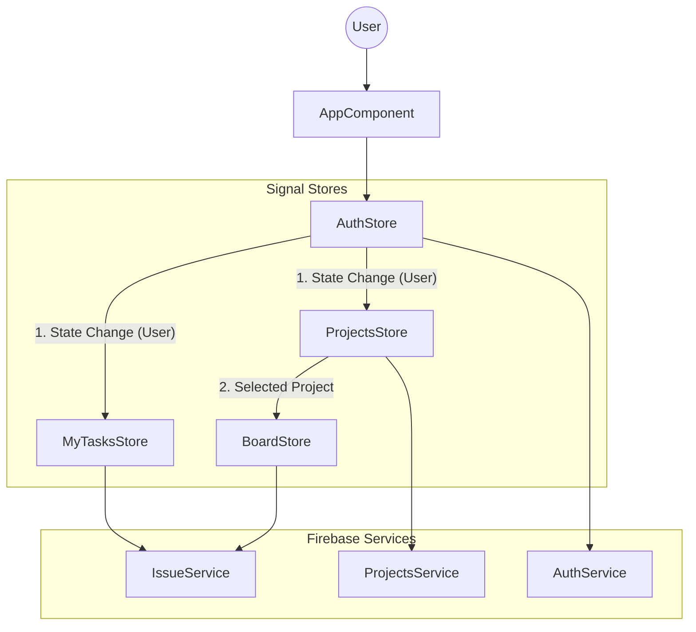

# Tài Liệu Chi Tiết Dự Án Jira Clone (Angular + Signals + Firebase)

Tài liệu này giải thích cấu trúc dự án, nhiệm vụ của từng file, luồng dữ liệu và cách các thành phần liên kết với nhau.

## 1. Tổng Quan Kiến Trúc

Dự án được xây dựng dựa trên các công nghệ hiện đại nhất của Angular (tính đến 2024+):

- **Angular Standalone Components**: Loại bỏ hoàn toàn NgModules.
- **NgRx Signals Store**: Quản lý trạng thái (State Management) gọn nhẹ, reactive.
- **Firebase**: Backend-as-a-Service (Authentication & Firestore Database).
- **Material UI**: Thư viện giao diện chuẩn.

## 2. Cấu Trúc Thư Mục (`src/app`)

### `core/` (Lõi ứng dụng)

Chứa các thành phần dùng chung, singleton services, và các logic nghiệp vụ cốt lõi không gắn liền với UI cụ thể nào.

- **`auth/`**
  - `auth.service.ts`: Service giao tiếp trực tiếp với Firebase Auth (Login Google, Email/Pass, Logout).
  - `auth.store.ts`: **Global Store** lưu trữ trạng thái người dùng đăng nhập (`user`, `loading`, `error`). Nó được inject ở root và các component khác lắng nghe thay đổi từ đây.
- **`services/`**
  - `error-notification.service.ts`: Service hiển thị thông báo (SnackBar) cho toàn bộ app. Giúp chuẩn hóa UI thông báo lỗi/thành công.
- **`models/`**
  - `app-user.model.ts`: Định nghĩa kiểu dữ liệu `AppUser`.
- **`components/`**
  - `breadcrumbs/`: Component điều hướng breadcrumb dùng chung.

### `features/` (Tính năng)

Chứa các module tính năng chính của ứng dụng. Mỗi feature thường có Store riêng và các UI Components.

- **`projects/`** (Quản lý Dự án)
  - `projects.service.ts`: Giao tiếp Firestore collection `projects`. Xử lý CRUD dự án, mời thành viên.
  - `projects.store.ts`: **Store** quản lý danh sách dự án, dự án đang chọn, và danh sách lời mời.
    - _Liên kết_: Lắng nghe `AuthStore` để tự động tải dự án khi user đăng nhập.
  - `project-create/`: Component tạo dự án mới.
  - `project-list/`: Component hiển thị danh sách dự án.
- **`board/`** (Bảng Kanban)

  - `board.store.ts`: **Store** quản lý danh sách tasks (issues) của dự án hiện tại, trạng thái kéo thả, và bộ lọc (filter).
  - `board.component.ts`: UI chính của bảng Kanban (các cột Todo, In Progress, Done).
  - `board-filter/`: Component con xử lý UI bộ lọc (theo user, search...).

- **`issue/`** (Công việc/Task)

  - `issue.service.ts`: Giao tiếp Firestore collection `issues`.
  - `issue.model.ts`: Định nghĩa Interface `Issue`.
  - `issue-dialog/`: Form thêm/sửa task (dùng chung cho cả tạo mới và edit).

- **`my-tasks/`** (Công việc của tôi)

  - `my-tasks.store.ts`: **Store** riêng biệt chỉ load các tasks được assign cho user hiện tại.
  - `my-tasks.ts`: UI hiển thị danh sách dạng bảng (Table).

- **`auth/`** (Giao diện đăng nhập)
  - `login/`: Màn hình đăng nhập/đăng ký.

### `shared/` (Tiện ích chia sẻ)

- **`store-features/`**
  - `with-loading-error.feature.ts`: Một custom feature cho SignalStore. Nó là một đoạn logic tái sử dụng giúp thêm state `loading` và `error` vào bất kỳ Store nào (AuthStore, BoardStore...) mà không cần viết lại code.

---

## 3. Luồng Hoạt Động & Liên Kết (Data Flow)

Kiến trúc tuân theo mô hình **Unidirectional Data Flow** (Luồng dữ liệu một chiều) với SignalStore.

### A. Luồng Xác Thực (Authentication Flow)

1. **User vào App**: `AppComponent` khởi tạo, gọi `AuthStore`.
2. **Auto Login**: `AuthStore` (trong `onInit`) lắng nghe Firebase Auth state. Nếu có user, nó cập nhật state `user`.
3. **Lan truyền (Reactivity)**:
   - `ProjectsStore` (trong `onInit`) đang lắng nghe `AuthStore.user()`.
   - Ngay khi có user, `ProjectsStore` tự động gọi API tải danh sách dự án.
   - `MyTasksStore` cũng lắng nghe và tự động tải danh sách task cá nhân.
4. **Logout**: Khi gọi `AuthStore.logout()`, state `user` về `null`. Các Store kia tự động phát hiện và xóa dữ liệu (về rỗng) để bảo mật và tránh lỗi permission.

### B. Luồng Quản Lý Dự Án (Project Flow)

1. **Chọn Dự án**: Người dùng click vào dự án trên Sidebar -> Router chuyển hướng `/project/:id`.
2. **Load Dữ liệu Bảng**: `BoardComponent` đọc `id` từ URL, gọi `BoardStore.loadIssues(id)`.
3. **Hiển thị**: `BoardStore` gọi `IssueService` lấy danh sách task về và render lên các cột.

### C. Luồng Tạo/Sửa Task

1. **Action**: User bấm "Add Issue" hoặc click vào thẻ task.
2. **Dialog**: Mở `IssueDialog`.
3. **Lưu**: Khi User bấm Save -> Trả dữ liệu về `BoardComponent`.
4. **Optimistic Update (Cập nhật lạc quan)**:
   - `BoardStore` cập nhật UI **ngay lập tức** (thêm thẻ mới vào cột) để app cảm giác nhanh như chớp.
   - Sau đó mới gọi API `IssueService` để lưu xuống Firestore.
   - Nếu API lỗi -> Store tự rollback (hoàn tác) lại UI cũ và báo lỗi.

### D. Kéo Thả (Drag & Drop)

1. **User kéo thả**: `cdkDragDrop` module xử lý sự kiện kéo.
2. **Tính toán**: Khi thả, `BoardStore` tính toán lại `order` (vị trí sắp xếp) và `statusColumnId` (cột mới).
3. **Batch Update**: Nếu chỉ đổi chỗ, Store tính toán lại order của các task bị ảnh hưởng và gửi một lệnh `batch request` lên Firestore để cập nhật hàng loạt vị trí một lúc.

## 4. Biểu Đồ Liên Kết Chính

## 5. Điểm Mạnh Của Kiến Trúc Này

1.  **Autonomous (Tự chủ)**: Các Store tự quản lý vòng đời dữ liệu của mình dựa trên `AuthStore`. Component không cần lo việc "khi nào load data", "khi nào xóa data".
2.  **Performance**: Sử dụng `Signals` giúp Angular chỉ render lại chính xác những phần UI thay đổi (fine-grained reactivity), không kiểm tra lại toàn bộ cây component.
3.  **Scalability**: Logic tách biệt rõ ràng. Muốn thêm tính năng mới chỉ cần thêm Feature folder mới với Store riêng, không ảnh hưởng cái cũ.
